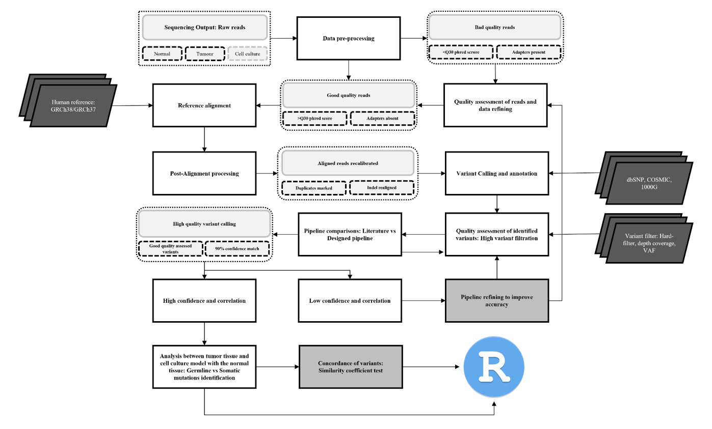

# Targeted-Sequencing-analysis-pipeline-for-Breast-Cancer
====================================================

## Description:

This pipeline is designed for Next-Generation, targeted sequenced analysis of Breast Cancer tumor samples and their associated Patients-specific BC Organoids (PDOs)

## Thesis

The pipeline was constructed and designed by **Kgopotso Phakwago** for the following thesis titled:

**_The evaluation and assessment of breast-cancer related genes between established patient-derived organoids and their tumor of origin within African patients_**


When used, **please site:** _Phakwago K. et al. The evaluation and assessment of breast-cancer related genes between established patient-derived organoids and their tumor of origin within African patients_  

URL to manuscript:

Queries can be sent to: kgopotso.phakwago@protonmail.com

-------------------------------------------------
## Getting Started
------------------

### 1. Required dependencies 

**Pipeline Programming language used**
1 [python3] (https://www.python.org/) (python v3.9)

**Packages/programs Implemented into the analysis**
* [Genome analysis toolkit](https://gatk.broadinstitute.org/hc/en-us) (gatk v4.2.6.1)
* [Burrows-Wheeler Aligner](https://github.com/lh3/bwa) (bwa v0.7.17)
* [Samtools](http://www.htslib.org/download/) (samtools v1.9)
* [Picard-tools](https://github.com/broadinstitute/picard) (picard v2.21)
* [Annovar](https://annovar.openbioinformatics.org/en/latest/) (annovar)


To get started with the following pipeline, a set number of reference files and databases are required. To download the reference files and their requested databases, run the following bash script:

### *Install automatically*

    $ bash get_analysis_databases.sh -r <hg19 or hg38>

The script above will allow you to download the required database list below into their respective paths. The script depends on which version do you want to use.
* GRCh37/hg19
    - variant calling reference files: hg_19_indels.knownsites.vcf, hg19_snp.knownsites.vcf, hg19_Mills_indels.knownsites.vcf
    - annotationt reference files: hg19_AFR/AMR/EAS/EUR_2015_08.txt, hg19_cosmic.txt, hg19_refGene.txt, hg19_snp142.txt, hg19_clinvar_20240611.txt
* GRCh38/hg38
    - variant calling reference files: hg_19_indels.knownsites.vcf, hg19_snp.knownsites.vcf, hg19_Mills_indels.knownsites.vcf
    - annotationt reference files: hg38_AFR/AMR/EAS/EUR_2015_08.txt, hg38_cosmic70.txt, hg38_refGene.txt, hg38_avsnp147.txt, hg38_clinvar_20240611.txt 

* Manually download the fasta file reference from NCBI Genbank:
    - human genome reference file GRCh37/hg19 reference fasta file or
    - human genome reference file GRCh38/hg38 reference fasta file

### 2. Workflow diagram



#### *Input files*

Your input paired-end FastQ file should independantly be processed before they are used in this pipeline. Programs such as [FastQC](https://www.bioinformatics.babraham.ac.uk/projects/fastqc/) can help moniter and access the quality of your reads. For targeted sequenced data, a phred-quality score of Q30 and above is required for detecting variants at a high quality. If you have files with a phred-score below Q30, then you can trim off low qualty reads and remove posible adapter artifacts to reduce false positives and increase the quality of your reads. Programs such as [Trimmomatic](http://www.usadellab.org/cms/?page=trimmomatic) can help remove such files.
   
Your FastQ paired-end files should have either a suffix of ${SAMPLE}_1/2.fastq.gz or ${SAMPLE}_R1/R2_001.fastq.gz, where $SAMPLE corresponds to the Identity name of your file. The pipeline by default experts input files with the extension "fastq.gz". if your files are gzipped, run the command in the folder containing your zipped fastQ files `$ gunzip /path/to/your/input`. 

#### 3. Perform Analysis
 
Basic Usage

To run the basic command for viewing of the analysis main pipeline usage, run the following command under `${scripts}` directory:

```
    $ run_main_targeted_sequencing_pipeline.py -h

optional arguments:
  -h, --help            show this help message and exit

  -i INPUT_PATH, --input_path INPUT_PATH
                        please specify the paired-end fastQ files with extension <{file}_1/2.fastq> or <{input}_R1/R2_001.fastq>

  -r REFERENCE_SEQUENCE_FILE, --reference_sequence_file REFERENCE_SEQUENCE_FILE
                        specify the human reference sequence.fasta (not fna). Remember the prefix starts with the reference type <hg19 or hg38>

  -p {perform,ignore}, --bqsr {perform,ignore}
                        perform base quality score recalibration (bqsr)?

  -a {somatic,germline}, --analysis_type {somatic,germline}
                        Perform analysis for <germline variants> or <somatic variants> ?

  -b TARGETED_REGIONS, --targeted_regions TARGETED_REGIONS (Default: None)
                        please specify the targeted regions used for preparing the illumina panel libraries, Optional
```

Running the analysis
---------------------------------
NOTE: Before running the script, a human reference sequence needs to be downloaded from NCBI genbank. The reference sequence then needs to have a prefix that starts with hg19/hg38. The entry IDs for the reference need to show chromosome numbers, for instance chr1-chrY. Example run for the script:

    $ ./run_main_targeted_sequencing_pipeline.py -i <fastq.gz file path> -r ~/hg38_ref.101.fasta -p perform -a germline

The final output for the annotated files will be located in variant_annotated_files folder with a sufix name `.hg38_multianno.txt`. The combinde output files will be merged under `multiannotation_joined_output.tsv`


